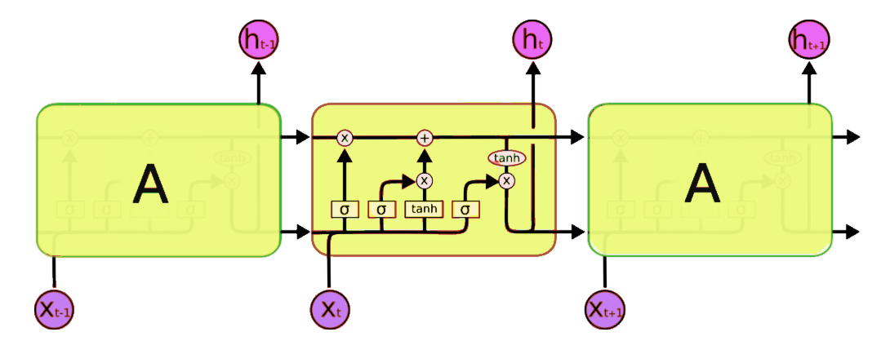
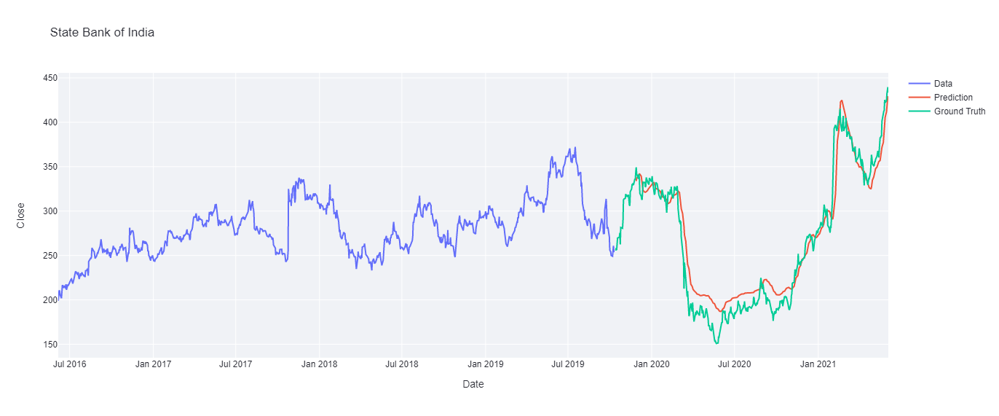
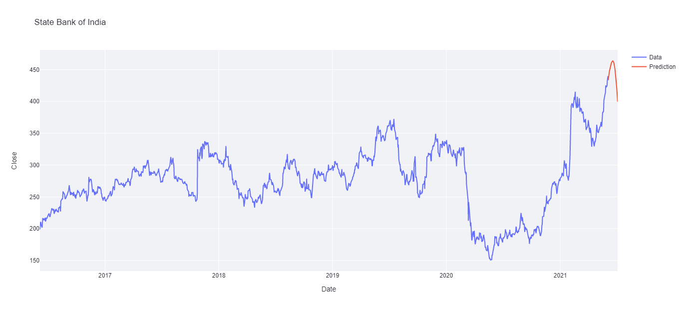
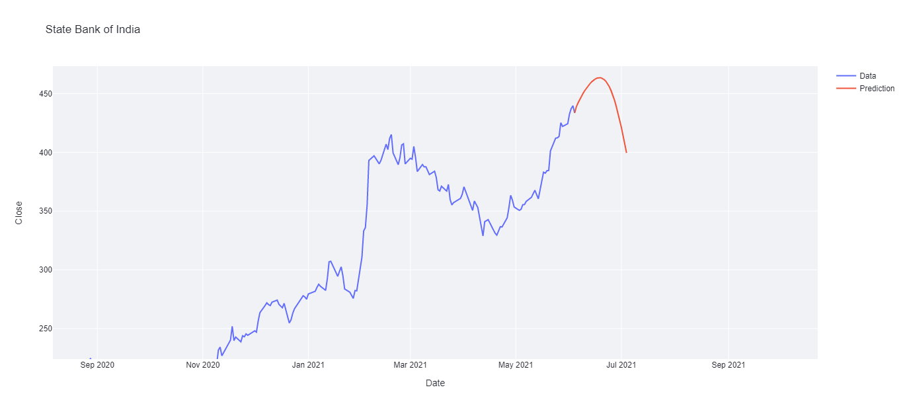

# Stock_Price_Prediction

Click [here](https://share.streamlit.io/52punk/stock_price_prediction/main/web-app-ui.py) and check the trends of stocks 😄

## Contributors

- [Mrinab Dey](https://github.com/mrinab/)
- [Pankaj Kumar Sah](https://github.com/52punk/)

## Run this locally

- Clone this repo, then run this command for installing the requirements

`pip install -r requirements.txt`

- After installing, run this command for launching the web-app

`streamlit run web-app-ui.py`

## Feature

- [Abstract](#abstract)
- [Introduction](#introduction)
- [Objective](#objective)
- [Literature Overview](#literature-overview)
- [Methodology](#methodology)
- [Tools Used](#tools-used)
- [Result Analysis](#result-analysis)
- [Future Scope](#future-scope)
- [References](#references)

## Abstract

In this project, we worked in the area of artificial intelligence. Artificial intelligence is the method in which we use certain algorithms and data to provide machines with an ability to think like a human. With the aid of artificial intelligence, machines get the ability to analyze a problem and make decisions based on the analysis to solve the problem. The importance of work can be determined from the fact that it will help us in determining the future price of a stock so that we can decide which stocks we need to invest in to earn good profits out of the market. And as all the predictions are made by machines themselves, no human effort is needed which eventually saves us a lot of time.In the project, we have used the previous price of a stock over a period of five years in order to determine the current price of the stock. This data was then pre-processed and fed into the model in order to train it. After the training is complete, our model was able to predict the stock prices.
The result that was achieved at the end of this project was quite impressive as the model was able to predict the trend successfully, it wasn’t 100% accurate but considering that it predicted only on the basis of the past data is quite impressive. The accuracy of the results showed that we could predict the stock prices quite accurately which would mean that we could use the same model to invest in the stock markets to earn good profits without much effort.
Considering the fact that the model used only the previous data to predict the future prices 
still it gave a decent result. The precision of the result can be increased by using market 
sentiments into it. Throughout this project we used python as the programming language, 
Spyder as the IDE and used many python libraries viz. tensorflow, scikit learn, plotly, 
streamlit, numpy, pandas and keras.

## Introduction
In this project, we worked in the area of artificial intelligence. Artificial intelligence is the method in which we use certain algorithms and data to provide machines with an ability to think like a human. With the aid of artificial intelligence, machines get the ability to analyze a problem and make decisions based on the analysis to solve the problem. The sub-field of artificial intelligence in which we worked is machine learning. Machine learning enables a machine to execute tasks without being explicitly programmed by a human. As machine learning has its own set of sub-fields, the sub-field of machine learning in which we worked is deep learning. Deep learning is that field of machine learning which enables a machine to mimic the human brain with regard to data processing and making patterns that helps in the process of decision making. 

## Objective
The main objective of our work was to build an LSTM model that accepts the day closing price of a stock as an input and processes the input to make predictions on the future price of the stock.In order to achieve the primary objective, we first had to collect the data and then process the data to make it into a valid input for the model. We also split the data for training and testing purpose. We then trained our model with the training data which enabled our model to predict the price of a stock.

## Literature Overview

* LSTM Architecture

  

`https://colah.github.io/posts/2015-08-Understanding-LSTMs/`

Read this article to understand LSTM architecture.

* LSTM vs RNN
Deep learning is an ever evolving field of machine learning as innovations are made every day in order to improve the field. The shortcomings of standard RNN’s not being able to 
handle long data sequence were solved by the introduction of LSTM and GRU. Since then, LSTM have been widely used in various fields including medical, image processing etc. 
Deep learning overcomes some of the limitations of machine learning through its ability to draw from data which that is unlabeled.

* Theoritical Discussion
Deep learning is a type of machine learning algorithm that uses more than one layer to extract higher-level features from the raw input data. Most of the deep learning models are based on ANN (Artificial Neural Networks). In deep learning, each level transforms its input data into more abstract and composite representation. The word deep learning is in reference to the number of layers through which the data is being transformed. Deep learning architectures are made using a greedy layer by layer method. Deep learning algorithms can be applied to unsupervised learning tasks. This gives us a huge benefit as unlabeled data is in more abundance as compared to labelled data.

## Methodology

For this project we’ve used the past data of the stock as our factor, we took last 5 years of stock’s performance data. The data was collected from yahoo finance’s website 

`https://in.finance.yahoo.com/`

It is a trusted site and the data is easily available and can be directly downloaded in .csv format.
After downloading the data we cleaned the data i.e., the data contained some null values and if raw data was fed in the model then it could either throw an error or the model wouldn’t had trained efficiently. So, the rows containing null values were deleted and data was cleaned.After cleaning the data, the thing we did was pre-processed the data i.e., we took only the closing prices column and then splitted it into two subgroups training data and testing data. Training data contained the data which we were going to use for training our model and the testing data contained the data upon which we were going to test our model. We took 67% of the data as our training data and rest for testing. 
This data was still not ready to be served in the model as our model expected time series data, so we converted the linear data into time series data.
After all the data pre-processing now we started to make our model, we made the model using tensorflow library present in python and used LSTM layers for making the model.
After creating the model we trained it on our training model for a particular number of epochs and after that checked the model’s accuracy for ensuring it efficiently trained. If the model’s performance was not up to the mark then we had done some hyperparameter tuning where we tuned some parameters such as number of epochs, number of LSTM layers, number of nodes present in the layers etc.
After all this our model was ready to be predicted, so we fed it with our testing data and predicted whether it yielded satisfying results or not. After the prediction work we then moved on to the forecasting part where the model future forecast performance for the chosen stock.

## Tools Used

- Programming Language
  - Python
- IDE
  - Spyder
- For Data cleaning and Data preprocessing:
  - numpy (1.19.2) – NumPy is a library for the Python programming language, adding support for large, multi-dimensional arrays and large collection of high-level mathematical        functions to operate on these arrays.
  - pandas (1.1.3) - Pandas is a software library written for the Python programming language for data manipulation and analysis. In particular, it offers data structures and operations for manipulating numerical tables and time series.
  - scikit_learn (0.24.2) - Scikit-learn is a free software machine learning library for the Python programming language. In this project it is used for data scaling.
- For making the model:
  - tensorflow (2.5.0) - TensorFlow is a free and open-source software library for machine learning. It can be used across a range of tasks but has a particular focus on training     and inference of deep neural networks
  - keras (2.5.0) - Keras is an open-source software library that provides a Python interface for artificial neural networks. Keras acts as an interface for the 
    TensorFlow  library.
- For Data visualization:
  - plotly (5.1.0) - Plotly provides online graphing, analytics, and statistics tools for individuals and collaboration, as well as scientific graphing libraries for 
    Python, R, MATLAB, Perl, Julia, Arduino, and REST.
- For the web app:
  - streamlit (0.83.0) - Streamlit is an open-source Python library that makes it easy to create and share beautiful, custom web apps for machine learning and data science

## Result Analysis

For State Bank of India:
We took 30 days stamp for arranging the original data into time series data. The model gave very nice result for this time series stamp. We made the model which consisted of 3 LSTM layers and one dense layer for getting the output, this model was trained for 100 epochs which in result yielded a decent forecast for next 30 days.
As we took 30 days as our time stamp, so we forecasted the prices for 30 days, we tried to forecast the prices for next 10, 60, 100 days but the result was not satisfactory as the model yielded some impractical results.
Moreover, if we wish to forecast the prices for next 60 or 100 days then we must train it for data using 60 or 100 time stamps respectively. The predicted and the forecasted plots are shown below:

* Predicted Graph

  

* Forecasted Graph

  

* Zoomed Image

  

## Future Scope

Predicting the stock market is a tuff job to do and we made our utmost effort to do so by time series analysis of past stock prices. But we also realised that only time series data analysis won’t be enough for predicting the stock market, so, we plan to take this project a level up by integrating NLP (Natural Language Processing ) algorithms for getting the sentiments of the market news, twitter trends etc and integrating it into this project and making it more capable to predict precise trends/prices of the stocks.

## References

- [LSTM architecture](https://colah.github.io/posts/2015-08-Understanding-LSTMs) by Oinkina
- [Time series forecasting](https://towardsdatascience.com) by towardsdatascience.com
- [Forecasting future prices](https://www.youtube.com/watch?v=H6du_pfuznE) by Krish Naik on YouTube
- [Time series prediction using deep learning](https://machinelearningmastery.com) by machinelearningmastery.com

